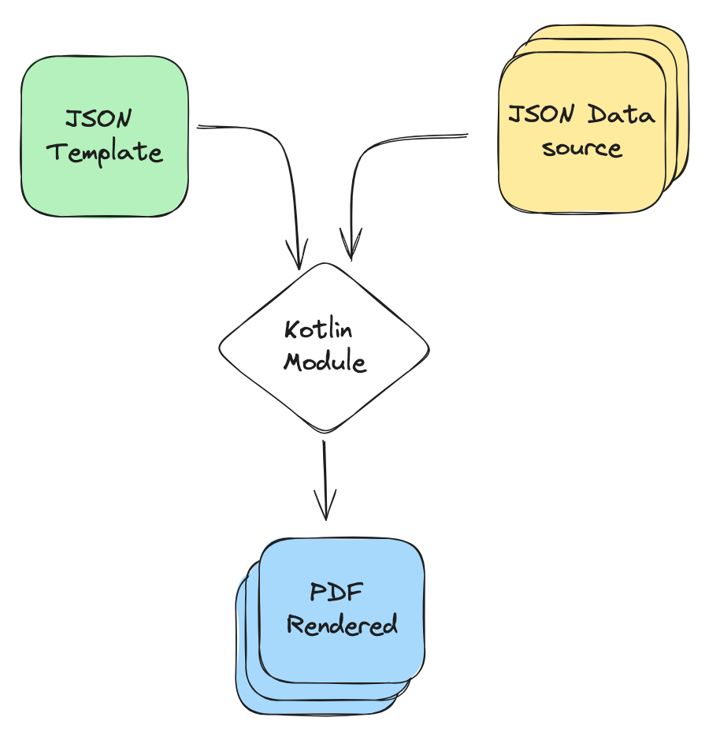
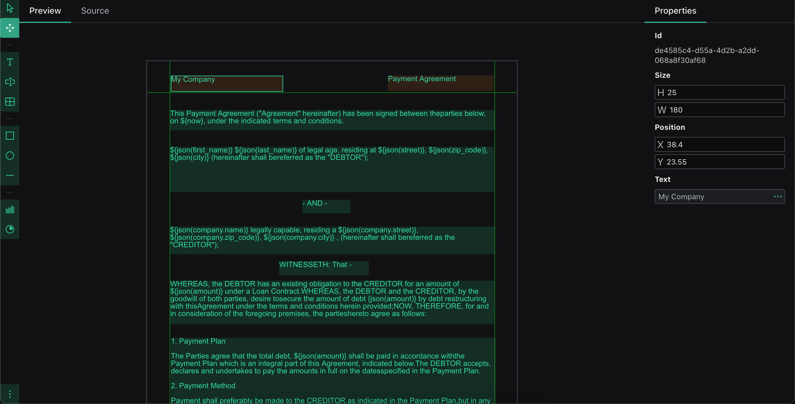
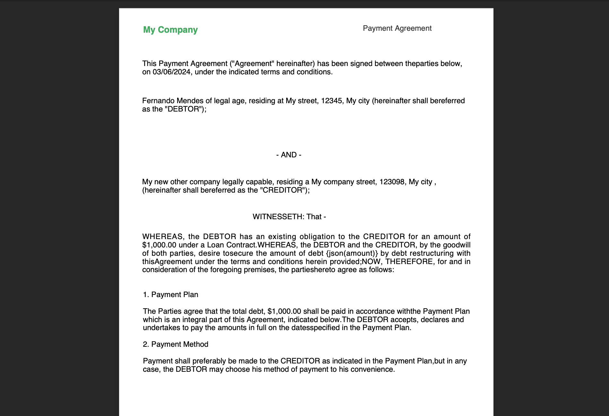

### NX PDF JSON Templates (UI Editor)

This is the UI Editor for editing your JSON Templates.

[Use Kotlin Module](https://github.com/lfernando2091/nx-pdf-template)

## What's this?

This is a concept project for dynamic PDF generation using JSON templates.

## How it works?

It works with JSON Templates; you define your PDF content using JSON structure and then render the content with the Kotlin/Java module.

## What's dynamic content generation?

In the Kotlin/Java module with your template, you can pass variables or an external JSON data source for rendering your PDF content.

For instance:

Variable:
- `var1 = Hello world`

Text:
- `"This is text example ${var1}"`

Output:
- `"This is text example Hello world"`

JSON data source:
- `[{ "user": { "name": "My Name", "age": 35 } }]`

Text:
- `"Welcome ${json(user.name)} your age is ${json(user.age)}"`

Output:
- `"Welcome My Name your age is 35"`



## Example JSON Template

A JSON template has a generic structure

```json
{
    "variables": { },
    "document": { }, 
    "content": {
        "header": { 
            "content": []
        },
        "body": {
            "pages": []
        },
        "footer": { 
            "content": []
        }
    }
}
```

- `variables`: You can define your global variables here with default values; you can easily overwrite them at runtime.

- `document`: You can add some document settings or metadata like author, title, and document margins.

- `content`: Here you can add your PDF content like paragraphs, text, images, and so on.

## UI Editor

You can use the UI Editor for easily modifying your JSON Template. You can edit or generate new templates.



## Render Template with module

Once you've defined your template, you can use the Kotlin/Java module for rendering your PDF. You can pass new values for your variables and add an external data source.



## References

Template used on the example
```json
{
  "variables": {
    "now": {
      "type": "Str",
      "value": "05/10/2024"
    }
  },
  "document": {
    "author": "Created with NX PDF Templates",
    "page_size": "A4",
    "margins": {
      "top": 50,
      "bottom": 36,
      "left": 36,
      "right": 36
    }
  },
  "content": {
    "header": {
      "content": [
        {
          "id": "de4585c4-d55a-4d2b-a2dd-068a8f30af68",
          "@type": "P",
          "value": "My Company",
          "alignment": "ALIGN_LEFT",
          "size": {
            "width": 180,
            "height": 25
          },
          "position": {
            "x": 38.4,
            "y": 23.55
          },
          "font": {
            "size": 14,
            "hexColor": "#009732cc",
            "fontFamily": "HELVETICA",
            "style": "BOLD"
          }
        },
        {
          "id": "5c43e5b5-d58a-460c-acb5-d63d9f932c08",
          "@type": "P",
          "value": "Payment Agreement",
          "alignment": "ALIGN_LEFT",
          "size": {
            "width": 169.9,
            "height": 25
          },
          "position": {
            "x": 387.55,
            "y": 22.53
          }
        }
      ]
    },
    "body": {
      "pages": [
        {
          "content": [
            {
              "id": "d890285d-b3a3-4fa3-8f8c-690145c39dd8",
              "@type": "P",
              "value": "This Payment Agreement (\"Agreement\" hereinafter) has been signed between theparties below, on ${now}, under the indicated terms and conditions.",
              "alignment": "ALIGN_LEFT",
              "size": {
                "width": 523,
                "height": 32.63
              },
              "position": {
                "x": 37,
                "y": 78.68
              }
            },
            {
              "id": "29fade47-86dc-491b-b186-05879747bc7c",
              "@type": "P",
              "value": "${json(first_name)} ${json(last_name)} of legal age, residing at ${json(street)}, ${json(zip_code)}, ${json(city)} (hereinafter shall bereferred as the \"DEBTOR\");",
              "alignment": "ALIGN_LEFT",
              "size": {
                "width": 521.09,
                "height": 73.27
              },
              "position": {
                "x": 36.96,
                "y": 137.87
              }
            },
            {
              "id": "93fbc5a2-e136-4446-9893-f2df1753e3d5",
              "@type": "P",
              "value": "- AND - ",
              "alignment": "ALIGN_LEFT",
              "size": {
                "width": 77.23,
                "height": 21.78
              },
              "position": {
                "x": 249.89,
                "y": 223.61
              }
            },
            {
              "id": "93c82ed8-01cb-4546-9315-2a219d464617",
              "@type": "P",
              "value": "${json(company.name)} legally capable, residing a ${json(company.street)}, ${json(company.zip_code)}, ${json(company.city)} , (hereinafter shall bereferred as the \"CREDITOR\");",
              "alignment": "ALIGN_LEFT",
              "size": {
                "width": 523.09,
                "height": 44.49
              },
              "position": {
                "x": 36.95,
                "y": 266.75
              }
            },
            {
              "id": "2b609af6-dd50-455b-bad8-52d22eaa252b",
              "@type": "P",
              "value": "WITNESSETH: That -",
              "alignment": "ALIGN_LEFT",
              "size": {
                "width": 143.99,
                "height": 22.77
              },
              "position": {
                "x": 212.51,
                "y": 322.61
              }
            },
            {
              "id": "c9f9e758-c8cb-4be5-ad07-058c2668c692",
              "@type": "P",
              "value": "WHEREAS, the DEBTOR has an existing obligation to the CREDITOR for an amount of ${json(amount)} under a Loan Contract.WHEREAS, the DEBTOR and the CREDITOR, by the goodwill of both parties, desire tosecure the amount of debt {json(amount)} by debt restructuring with thisAgreement under the terms and conditions herein provided;NOW, THEREFORE, for and in consideration of the foregoing premises, the partieshereto agree as follows:",
              "alignment": "ALIGN_JUSTIFIED",
              "size": {
                "width": 521.8,
                "height": 70.14
              },
              "position": {
                "x": 37.1,
                "y": 353.93
              }
            },
            {
              "id": "15b17f4e-85a5-4439-88bb-d14fd5dc5272",
              "@type": "P",
              "value": "1. Payment Plan\n\nThe Parties agree that the total debt, ${json(amount)} shall be paid in accordance withthe Payment Plan which is an integral part of this Agreement, indicated below.The DEBTOR accepts, declares and undertakes to pay the amounts in full on the datesspecified in the Payment Plan.\n\n2. Payment Method\n\nPayment shall preferably be made to the CREDITOR as indicated in the Payment Plan,but in any case, the DEBTOR may choose his method of payment to his convenience.",
              "alignment": "ALIGN_LEFT",
              "size": {
                "width": 522.8,
                "height": 142.6
              },
              "position": {
                "x": 38.09,
                "y": 446.2
              }
            }
          ]
        }
      ]
    },
    "footer": {
      "content": [
        {
          "id": "561cfc59-4bb4-425a-addb-1b7d6d1094bc",
          "@type": "P",
          "value": "Created with NX PDF Template",
          "alignment": "ALIGN_LEFT",
          "size": {
            "width": 293.07,
            "height": 27.78
          },
          "position": {
            "x": 41.97,
            "y": 811.6
          }
        }
      ]
    }
  }
}
```

JSON Data source used on the example
```json
[
  {
    "first_name": "Fernando",
    "last_name": "Mendes",
    "street": "My street",
    "zip_code": "12345",
    "city": "My city",
    "company": {
      "name": "My new other company",
      "street": "My company street",
      "zip_code": "123098",
      "city": "My city"
    },
    "amount": "$1,000.00"
  }
]
```

Code implementing the module

```kotlin
val source = NxJsonSource()
source.read(File("payment-agre-data.json"))
val setup = NxTemplate(source)
setup.load(
    File("payment-agre-template.json"),
    File("payment-agre-render.pdf"),
    mapOf("now" to "03/06/2024")
)
```